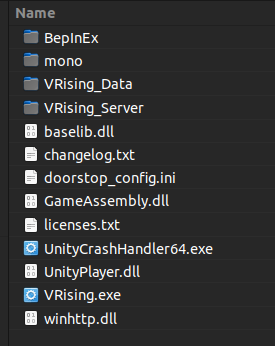

# Client

## Download

Download the latest release of BepInEx for V Rising from the [Thunderstore](https://v-rising.thunderstore.io/package/BepInEx/BepInExPack_V_Rising/) ([https://v-rising.thunderstore.io/package/BepInEx/BepInExPack_V_Rising/](https://v-rising.thunderstore.io/package/BepInEx/BepInExPack_V_Rising/))

## Installation

1. Extract the downloaded archive into a folder **(NOT THE GAME FOLDER)**
2. Inside the extracted folder you will find a folder called `BepInExPack_V_Rising`.
3. Open the `BepInExPack_V_Rising` folder in your file explorer.
4. Copy all of the contents of this folder into your game folder `steamapps/common/VRising/`.
5. Run the game.

The contents of your games directory should look like this:

### Server mods in singleplayer

To run server mods in singleplayer you need the [ServerLaunchFix](https://v-rising.thunderstore.io/package/Mythic/ServerLaunchFix/) mod. The reason is that even when you're playing singleplayer, the game launches a server for you in the background, and this server will not have the mods you have installed on your client by default. the [ServerLaunchFix](https://v-rising.thunderstore.io/package/Mythic/ServerLaunchFix/) mod ensures that all mods you have on the client exist on your local server

## Troubleshooting
