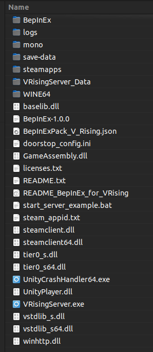

# Windows

## Base Server Installation

The preferred way to install game server would be via [**SteamCMD**](https://developer.valvesoftware.com/wiki/SteamCMD).

1. Create a folder for SteamCMD, eg `C:\steamcmd`
2. Download the latest release of [**SteamCMD**](https://steamcdn-a.akamaihd.net/client/installer/steamcmd.zip) (direct download link).
3. Extract `steamcmd.exe` from the downloaded archive to `C:\steamcmd\`
4. Create a new Text Document in `C:\steamcmd\` called `vrising-update.cmd` (make sure file extensions are shown, to avoid `vrising-update.cmd.txt`)
5. Rightclick the newly created file and click `Edit`, which should be the second option in the context menu.
    - If you are on Windows 11 click `Show more options` first after rightclicking the file.

Contents of `vrising-update.cmd`:

```batch
steamcmd.exe +login anonymous +app_update 1829350 validate +quit
```

6. Save and close the text editor.
7. Doubleclick the `vrising-update.cmd` file and it should install the game files
    - If it does not, and instead opens your text editor again, make sure to disable *Hide file Extensions* in your file explorer. and remove `.txt` from the file name and try again.
8. When the window closes, the server should be installed in `C:\steamcmd\steamapps\common\VRisingDedicatedServer\`

## Adding BepInEx

Download the latest release of BepInEx for V Rising from the [Thunderstore](https://v-rising.thunderstore.io/package/BepInEx/BepInExPack_V_Rising/) ([https://v-rising.thunderstore.io/package/BepInEx/BepInExPack_V_Rising/](https://v-rising.thunderstore.io/package/BepInEx/BepInExPack_V_Rising/)) Click the large **Manual Download** button.

1. Extract the downloaded archive into a folder **(NOT THE GAME SERVER FOLDER)**
2. Inside the extracted folder you will find a folder called `BepInExPack_V_Rising`.
3. Open the `BepInExPack_V_Rising` folder in your file explorer.
4. Copy all of the contents of this folder into your game folder `C:\steamcmd\steamapps\common\VRisingDedicatedServer\`.
    - **Do NOT extract it into `VRisingServer_Data`!**

The contents of your server directory should look like this:



5. Create a `start.cmd` file inside the `C:\steamcmd\steamapps\common\VRisingDedicatedServer\` folder.
    - You should by now know how to create a `.cmd` file and avoid `.cmd.txt`

Contents of `start.cmd`:

```
@echo off

REM - Set to your preferred preferences
set SERVER_NAME=Your Servername Here
set SAVE_NAME=World

REM - DO NOT EDIT BELOW THIS LINE
set SERVER_DIR=%~dp0

VRisingServer.exe -persistentDataPath save-data -serverName "%SERVER_NAME%" -saveName "%SAVE_NAME%" -logFile %SERVER_DIR%\logs\VRisingServer.log
```
6. Save and close the text editor
7. Run `start.cmd` to start the server

To verify that BepInEx is succesfully loaded on the server.
